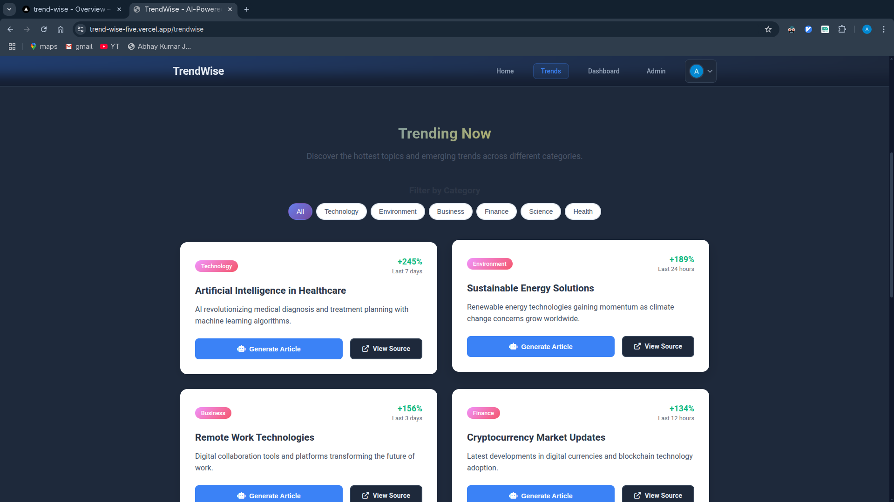
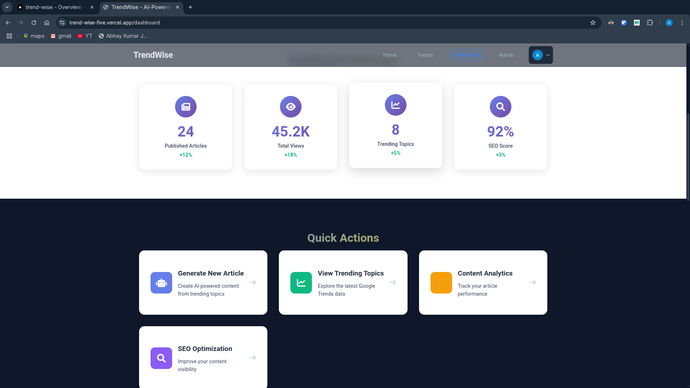
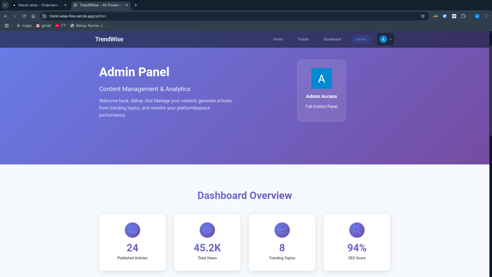
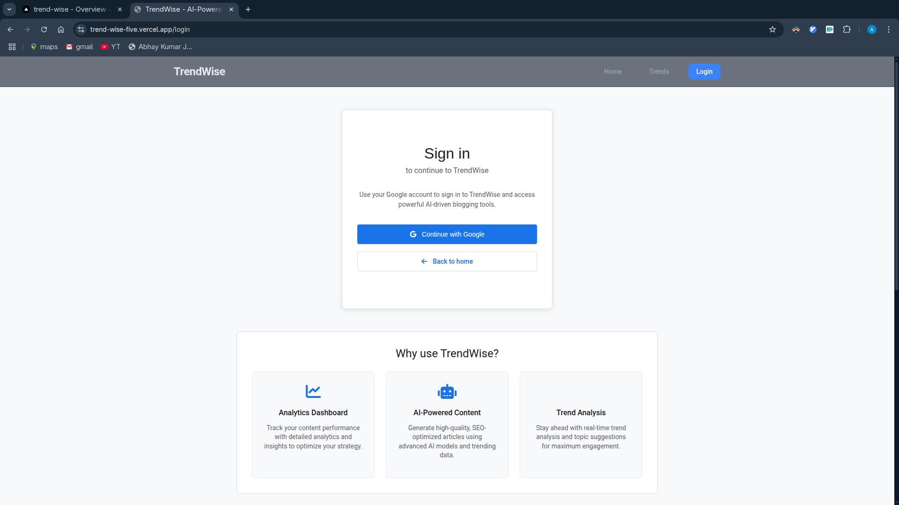
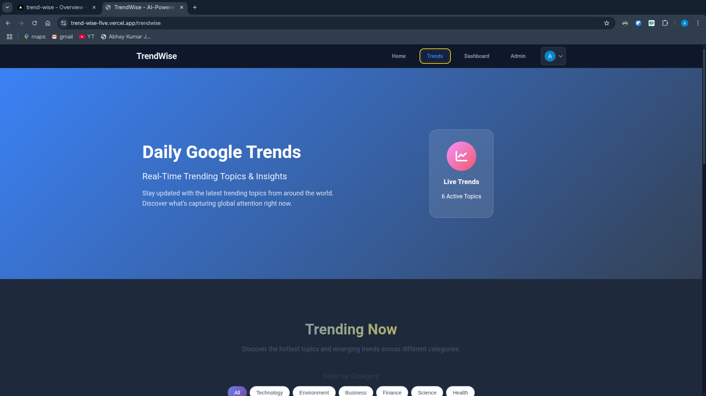

# 📈 TrendWise

A smart content performance analyzer designed to help users track and visualize trends in online articles using AI-backed insights and visual dashboards.

🔗 **Live Demo:** [https://trend-wise-five.vercel.app/](https://trend-wise-five.vercel.app/)  
💼 **Portfolio:** [https://dotbillu.github.io/Portfolio/](https://dotbillu.github.io/Portfolio/)

---

## 🖼️ Screenshots

<p align="center">
  
  <br/>
  
  <br/>
  
  <br/>
  
  <br/>
  
</p>

---

## 🧠 Overview

**TrendWise** allows users to:

- 📰 Submit articles for analysis
- 📊 Get keyword extraction and tag suggestions
- 🧵 View top comments and discussion trends
- 🔐 Log in securely using Google OAuth
- ⚡ Auto-generates metadata for content optimization

It's ideal for bloggers, media analysts, or anyone wanting to stay on top of content relevance and engagement.

---

## ✨ Features

- 🔍 **Real-time content analysis**
- 📌 **Trending keyword & tag detection**
- 🗨️ **Comment sentiment overview**
- 📈 **Content-level analytics dashboard**
- 🔒 **Google Sign-In via NextAuth**
- 🎨 **Modern responsive UI with grain patterns & Inter fonts**

---

## 🛠️ Tech Stack

| Frontend        | Backend             | Auth         | Hosting        |
|-----------------|---------------------|--------------|----------------|
| Next.js 14      | Express.js + Node   | NextAuth.js  | Vercel & Render |
| Tailwind CSS    | MongoDB (Mongoose)  | Google OAuth |                |
| TypeScript      | REST API            |              |                |

---

## ⚙️ Setup Instructions

> Prerequisites: Node.js, MongoDB Atlas, Google Cloud OAuth setup

1. **Clone this repo:**

   ```bash
   git clone https://github.com/yourusername/trendwise.git
   cd trendwise
   ```

2. **Install dependencies:**

   ```bash
   npm install
   ```

3. **Configure environment variables:**

   Create `.env.local` in `/client` and `.env` in `/server` with the following:

   ```env
   # Frontend (client/.env.local)
   NEXT_PUBLIC_BACKEND_URL=https://trendwise-mt1w.onrender.com
   NEXT_PUBLIC_FRONTEND_URL=https://trend-wise-five.vercel.app
   NEXTAUTH_URL=https://trend-wise-five.vercel.app
   NEXTAUTH_SECRET=your-32-byte-random-secret
   GOOGLE_CLIENT_ID=your-client-id
   GOOGLE_CLIENT_SECRET=your-client-secret
   ```

   ```env
   # Backend (server/.env)
   MONGODB_URI=your-mongodb-connection-uri
   ```

4. **Run locally:**

   ```bash
   # Start backend
   cd server
   npm start

   # Start frontend (in another terminal)
   cd client
   npm run dev
   ```

---

## 🚀 Deployment

- **Frontend:** Hosted on Vercel
- **Backend API:** Deployed on Render

Make sure environment variables are properly configured in Vercel and Render dashboards.

---

## 👨‍💻 Developer

Built by Abhay Jha  
💼 [Portfolio](https://dotbillu.github.io/Portfolio/)  
💌 Reach out for collaborations or feedback!

---

## 📝 License

MIT License — feel free to use, modify, and build on top of it 🚀